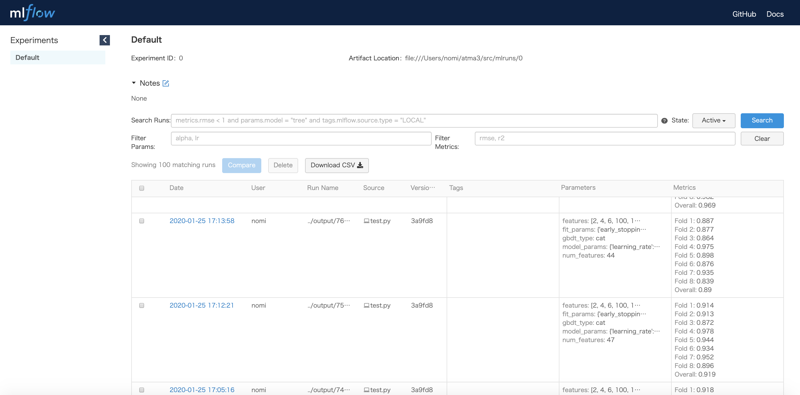

Tracking your machine learning experiments with run_experiment
===============================================================

Concept
-------------------------------

In a typical tabular data competition, you may probably repeat evaluating your idea
by cross-validation with logging the parameters and results to track your experiments.

The ``nyaggle.experiment.run_experiment`` is an API for such situations.
If you are using LightGBM as your model, the code will be quite simple:

.. code-block:: python

  import pandas as pd
  from nyaggle.experiment import run_experiment
  from nyaggle.experiment import make_classification_df

  INPUT_DIR = '../input'
  target_column = 'target'

  X_train = pd.read_csv(f'{INPUT_DIR}/train.csv')
  X_test = pd.read_csv(f'{INPUT_DIR}/test.csv')
  sample_df = pd.read_csv(f'{INPUT_DIR}/sample_submission.csv')  # OPTIONAL

  y = X_train[target_column]
  X_train = X_train.drop(target_column, axis=1)

  lightgbm_params = {
      'max_depth': 8
  }

  result = run_experiment(lightgbm_params, 
                          X_train, 
                          y, 
                          X_test,
                          sample_submission=sample_df)

The ``run_experiment`` API performs cross-validation and stores artifacts to the logging directory. You will see the output files stored as follows:

::

    output
    └── 20200130123456          # yyyymmssHHMMSS
        ├── params.json         # Parameters
        ├── metrics.json        # Metrics (single fold & overall CV score)
        ├── oof_prediction.npy  # Out of fold prediction
        ├── test_prediction.npy # Test prediction
        ├── 20200130123456.csv  # Submission csv file
        ├── importances.png     # Feature importance plot
        ├── log.txt             # Log file
        └── models              # The trained models for each fold
              ├── fold1
              ├── fold2
              ├── fold3
              ├── fold4
              └── fold5

.. hint::
  The default validation strategy is a 5-fold CV. You can change this behavior by passing ``cv`` parameter
  (see API reference in detail).

If you want to use XGBoost, CatBoost or other sklearn estimators,
specify the type of algorithm:

.. code-block:: python

  # CatBoost
  catboost_params = {
      'eval_metric': 'Logloss',
      'loss_function': 'Logloss',
      'depth': 8,
      'task_type': 'GPU'
  }
  result = run_experiment(catboost_params, 
                          X_train,
                          y, 
                          X_test,
                          algorithm_type='cat')

  # XGBoost
  xgboost_params = {
      'objective': 'reg:linear',
      'max_depth': 8
  }
  result = run_experiment(xgboost_params, 
                          X_train, 
                          y, 
                          X_test,
                          algorithm_type='xgb')

  # sklearn estimator
  from sklearn.linear_model import Ridge
  rigde_params = {
      'alpha': 1.0
  }
  result = run_experiment(rigde_params, 
                          X_train, 
                          y, 
                          X_test,
                          algorithm_type=Ridge)

.. hint::
  The parameter will be passed to the constructor of sklearn API (e.g. ``LGBMClassifier``).

Collaborating with mlflow
------------------------------

If you want GUI dashboard to manage your experiments, you can use ``run_experiment`` 
with mlflow by just setting ``with_mlfow = True`` (you need to install mlflow beforehand).

.. code-block:: python

  result = run_experiment(params, 
                          X_train, 
                          y, 
                          X_test, 
                          with_mlflow=True)

In the same directory as the script executed, run

.. code-block:: bash

  mlflow ui

and view it at http://localhost:5000 .
On this page, you can see the list of experiments with CV scores and parameters.

If you want to customize the behavior of logging, you can call ``run_experiment`` in
the context of mlflow run. If there is an active run, ``run_experiment`` will use the
currently active run instead of creating a new one.

.. code-block:: python

  mlflow.set_tracking_uri('gs://ok-i-want-to-use-gcs')

  with mlflow.start_run(run_name='your-favorite-run-name'):
      mlflow.log_param('something-you-want-to-log', 42)

      result = run_experiment(params, 
                              X_train, 
                              y, 
                              X_test,
                              with_mlflow=True)

What does ``run_experiment`` not do?
-------------------------------------

``run_experiment`` can be considered as a mere cross-validation API with logging functionality.
Therefore, you have to choose model parameters and perform feature engineering yourself.
